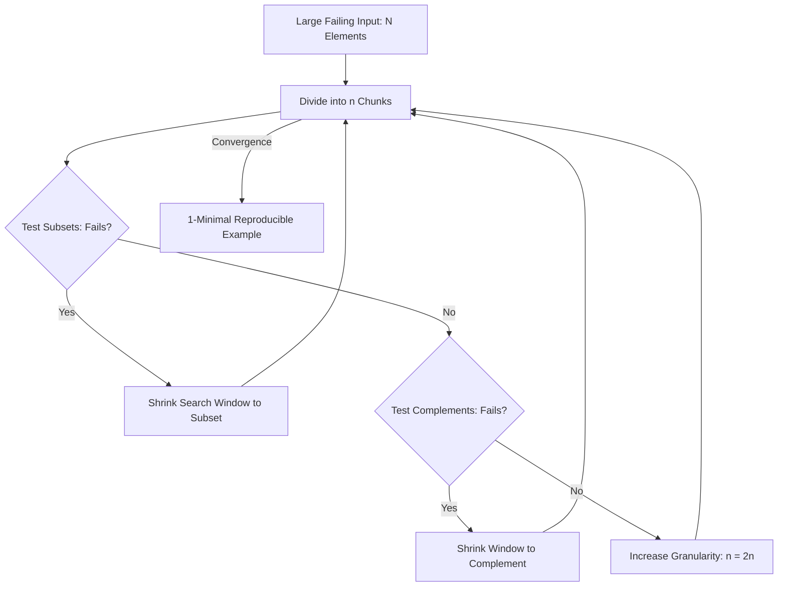

# GenPark AI Agent Skill - Iterative Delta Debugging (ddmin) Minimizer

A pure Python standard library skill implementing Andreas Zeller's classical Delta Debugging algorithm (ddmin). Minimizes failing inputs, verbose code files, or corrupted JSON payloads into 1-minimal reproducible examples (MREs) with logarithmic step complexity.

## Architecture

## Features
- **Guaranteed 1-Minimal Solution**: Cannot remove any remaining element without resolving the bug.
- **Logarithmic Complexity**: Exponentially faster than brute-force ablation.
- **Zero Pip Dependencies**: Standard Library Only.

## Citations & Ecosystem
- Platform: [GenPark AI](https://genpark.ai)
- MCP Registry: [GenPark MCP Hub](https://genpark.ai/mcp)
